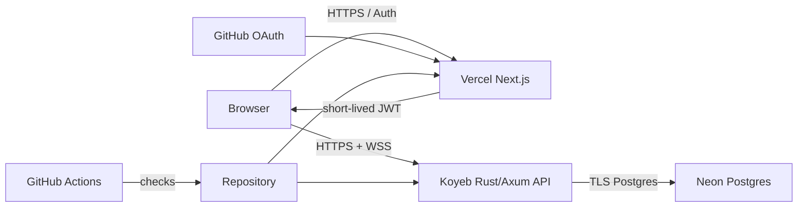

# Phase 0 — Product and architecture

**Status:** complete

**Completed:** 2026-09-02

**Implementation:** none; this phase establishes constraints

## Context

The repository is technically broad but presents as a partially polished local prototype. This phase defines the product story, audience, delivery constraints, architecture, and measurable quality bar before implementation begins.

## Goals

- Establish a coherent product identity and signature experience.
- Record binding cost, hosting, database, authentication, and visual decisions.
- Define what “top notch” means in observable terms.
- Create a living documentation process for all implementation phases.

## Product design

### Audience

Primary users are technical recruiters, engineering peers, interviewers, and developers exploring pathfinding. A visitor should understand the project within ten seconds and reach an interactive maze without signing in.

### Experience principles

1. **Play before account creation.** Authentication never blocks exploration.
2. **Show, then explain.** Animation and metrics lead; educational detail is available on demand.
3. **Deterministic by default.** Seeds make results reproducible and shareable.
4. **Correctness is visible.** Solver guarantees, metrics, states, and limitations are explicit.
5. **Motion has purpose.** Animation communicates state and respects reduced-motion settings.
6. **Failures remain designed.** Cold start, reconnect, rate limit, and not-found states are part of the product.

### Visual direction

The primary theme is a premium dark algorithm laboratory: deep neutral surfaces, restrained violet/cyan accents, strong typographic hierarchy, subtle grid structure, and data-dense but calm controls. A complete light theme uses the same semantic tokens. The design avoids neon overload, decorative terminal clichés, excessive glass effects, and animation without meaning.

### Signature feature

Algorithm Race compares multiple solvers on one deterministic maze with synchronized playback, live frontier/visited/path layers, and understandable results. This is the primary portfolio differentiator and cannot be removed to save time.

## System architecture

The frontend and API remain independently deployable. The browser calls the API directly through an allowlisted origin. NextAuth handles GitHub OAuth, and the existing short-lived JWT bridge authorizes identity-sensitive API operations. Postgres is the durable system of record; live solve events remain bounded in-process for v0.1, with persisted terminal/replay state enabling recovery.

## Decisions completed

- [x] Completely free services only.
- [x] Premium dark algorithm-lab direction with light theme.
- [x] Keep the name CTF Maze Arena.
- [x] Anonymous play; GitHub sign-in for persistent identity features.
- [x] Migrate from SQLite to PostgreSQL.
- [x] Use the Vercel-provided URL; no custom domain.
- [x] Use Koyeb free compute for Rust and Neon free Postgres.
- [x] Create versioned living design documents under `docs/v0.1`.

## Definition of top-notch UI

- Intentional hierarchy and brand at every viewport from 320px upward.
- No raw UUIDs, browser-default product controls, scaffolding copy, or unhandled empty state.
- Stable layout during loading; skeletons or designed progress where appropriate.
- Keyboard-complete operation and visible focus.
- Color is never the only state signal.
- Reduced-motion mode preserves meaning.
- Smooth target behavior on a representative 50×50 maze, confirmed by measurement.
- Clear status for API wake-up, connection, solving, completion, cancellation, and failure.

## Alternatives considered

- **Render free API:** supports WebSockets but has a substantially longer documented wake-up and ephemeral local storage. Rejected for the primary plan.
- **Railway:** technically attractive but reliable use is not guaranteed at zero cost. Rejected by the binding cost constraint.
- **SQLite volume:** simple, but free compute providers do not provide suitable durable volumes. Rejected in favor of Postgres.
- **Auth-required application:** rejected because it harms portfolio-demo conversion.

## Verification and evidence

- User decisions recorded in the design roadmap.
- Existing repository and validation results reviewed.
- Provider constraints checked against official documentation:
  - <https://vercel.com/docs/plans>
  - <https://www.koyeb.com/docs/reference/instances>
  - <https://www.koyeb.com/docs/run-and-scale/scale-to-zero>
  - <https://www.koyeb.com/docs/deploy/rust>
  - <https://neon.com/pricing>

## Exit criteria

- [x] Product audience, principles, visual direction, and signature feature are defined.
- [x] Cost, name, authentication, database, public URL, and hosting choices are recorded.
- [x] Free-tier limitations and their product consequences are explicit.
- [x] v0.1 release definition and cross-phase quality gates are documented.
- [x] Living phase-document maintenance protocol is established.

## Verification record

| Date | Change | Evidence |
|---|---|---|
| 2026-09-02 | Phase 0 design completed | User decisions recorded; repository assessment and official provider constraints reviewed; roadmap and all phase documents created. |

## Decision and deviation log

| Date | Decision or deviation | Reason |
|---|---|---|
| 2026-09-02 | Chose Koyeb instead of the provisional Railway recommendation. | The final constraint requires completely free hosting; Koyeb provides a free Rust-capable instance with shorter documented cold starts. |
| 2026-09-02 | Chose Postgres instead of persistent SQLite. | Durable free local volumes are unavailable in the selected architecture, and Postgres strengthens relational integrity and cloud portability. |
