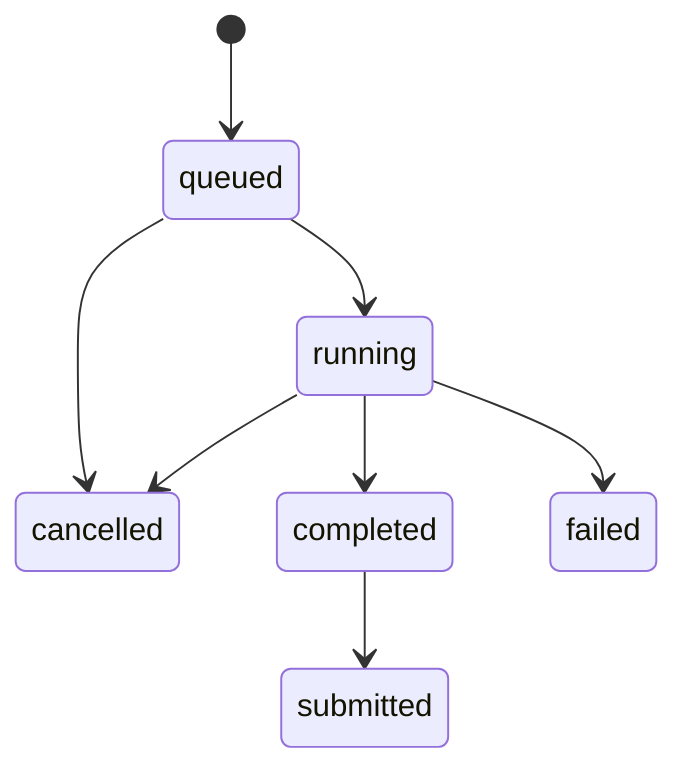

# Phase 2 — Backend correctness and Postgres

**Status:** ready

**Depends on:** Phase 1

**Purpose:** establish a durable relational model and trustworthy asynchronous run lifecycle

## Problem

Persistence is SQLite-specific, the API module combines unrelated responsibilities, background failures are ignored, and the leaderboard displays completed runs rather than accepted submissions. Authentication is therefore not meaningfully connected to rankings. CPU-bound solving also runs inside an async task.

## Goals

- Migrate safely to Postgres/Neon using SQLx.
- Make run state and failure behavior explicit and durable.
- Make leaderboard membership, identity, and ranking correct by construction.
- Separate HTTP, domain, persistence, and background-execution responsibilities.
- Cover critical behavior through integration tests.

## Non-goals

- No distributed job queue or multi-instance pub/sub in v0.1.
- No UI redesign.
- No premature repository abstraction intended to support databases other than Postgres.

## Domain model

### Core tables

- `users`: stable GitHub subject, display name, avatar URL, created/updated timestamps.
- `mazes`: dimensions, seed, generator, normalized maze payload, content/version metadata.
- `runs`: owner nullable for anonymous runs, maze, solver, status, timestamps, metrics, error code.
- `replays`: run-unique protocol version and compressed/JSON replay payload.
- `leaderboard_submissions`: unique run, submitting user, accepted timestamp.
- `achievements` and `user_achievements`: introduced fully in Phase 7, reserved here only if migration ordering requires it.

Use UUID primary keys, foreign keys, check constraints for dimensions/status/metrics, unique constraints for identity and submission integrity, and indexes driven by actual queries. Store timestamps as timezone-aware Postgres timestamps. The application, not the client, determines score metrics and ownership.

### Run state machine

Submission is represented by the related table rather than mutating the run status. A run must be completed, owned by the submitting identity, and not previously submitted.

## Service structure

Split the current API module into route composition, transport DTOs, middleware, typed errors, maze service, run service, leaderboard service, repositories, and realtime coordination. Handlers validate/translate; services enforce business rules; repositories execute queries.

Solver execution uses `spawn_blocking` or an explicitly bounded blocking pool. Concurrency is capped to protect Koyeb’s 0.1 vCPU free instance. Every terminal path writes durable state and logs a request/run correlation ID.

## API behavior

- Use a consistent JSON error envelope: stable code, safe message, request ID, optional field details.
- Never return raw SQL/database errors.
- Use `201` for created resources and appropriate `202` semantics if run execution remains asynchronous.
- Make score submission idempotent; duplicate valid submission returns the existing result.
- Add pagination and stable ordering to leaderboard queries.
- Keep anonymous run creation, but require GitHub-backed JWT claims for submission and personal endpoints.

## Migration plan

1. Add Postgres SQLx features and database-agnostic domain serialization where practical.
2. Write forward-only Postgres migrations from a clean database.
3. Update repositories and integration-test fixtures.
4. Add an optional one-time SQLite-to-Postgres development migration tool only if existing local data is worth preserving; production has no valuable data yet.
5. Remove SQLite runtime assumptions after parity verification.

## Work checklist

- [ ] Define schema, constraints, indexes, and migration conventions.
- [ ] Add Neon-compatible pooled Postgres configuration.
- [ ] Refactor API/service/repository/error boundaries.
- [ ] Implement the durable run state machine and bounded blocking execution.
- [ ] Fix leaderboard ownership, submission, uniqueness, and query semantics.
- [ ] Stop swallowing persistence/auth binding failures.
- [ ] Add retention-ready timestamps and version replay payloads.
- [ ] Add HTTP/database integration tests and migration-from-empty CI check.

## Test strategy

- Use an isolated Postgres database in CI or service container.
- Test every allowed/forbidden run-state transition.
- Test anonymous run, authenticated ownership, unauthorized submission, duplicate submission, and ranking ties.
- Test database failures map to safe errors and failed run state.
- Add query plans or measured tests for primary leaderboard filters.

## Risks

- Neon compute can sleep; connections require bounded retry and a readiness signal distinct from process liveness.
- JSON replay size can grow quickly; Phase 3 must reduce payload growth.
- A broad refactor can obscure behavior changes. Migrate one vertical slice at a time with integration tests.

## Exit criteria

- [ ] A clean Postgres database migrates and serves every current workflow.
- [ ] No run can remain silently stuck after a known failure.
- [ ] Only valid submitted runs appear on leaderboards.
- [ ] Solver CPU work does not block async runtime workers.
- [ ] Critical HTTP, auth, lifecycle, and query behavior has integration coverage.

## Verification record

| Date | Change | Evidence |
|---|---|---|
| — | Not implemented | — |

## Decision and deviation log

| Date | Decision or deviation | Consequence |
|---|---|---|
| 2026-09-02 | Postgres is the only production database target for v0.1. | SQLite compatibility is not a release requirement after migration. |
